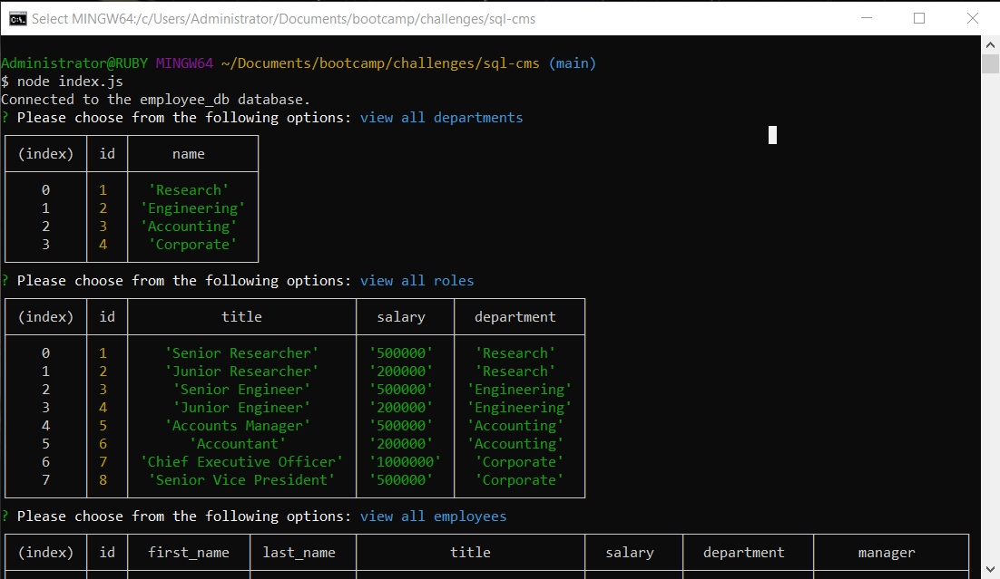

# SQL CMS

This program is a command-line **content management system** that provides an interface for a MySQL employee database.  It uses [Node.js](https://nodejs.org/en), [Inquirer](https://www.npmjs.com/package/inquirer), [dotenv](https://www.npmjs.com/package/dotenv), and [MySQL2](https://www.npmjs.com/package/mysql2).

## Program Logic

```
GIVEN a command-line application that accepts user input
WHEN I start the application
THEN I am presented with the following options: view all departments, view all roles, view all employees, add a department, add a role, add an employee, and update an employee role
WHEN I choose to view all departments
THEN I am presented with a formatted table showing department names and department ids
WHEN I choose to view all roles
THEN I am presented with the job title, role id, the department that role belongs to, and the salary for that role
WHEN I choose to view all employees
THEN I am presented with a formatted table showing employee data, including employee ids, first names, last names, job titles, departments, salaries, and managers that the employees report to
WHEN I choose to add a department
THEN I am prompted to enter the name of the department and that department is added to the database
WHEN I choose to add a role
THEN I am prompted to enter the name, salary, and department for the role and that role is added to the database
WHEN I choose to add an employee
THEN I am prompted to enter the employee’s first name, last name, role, and manager, and that employee is added to the database
WHEN I choose to update an employee role
THEN I am prompted to select an employee to update and their new role and this information is updated in the database
```

## Usage

From the command line, run the commands `npm install` and `node index.js`.  The typical program flow is shown in a video available [from this link](https://drive.google.com/file/d/1TP5GTEaWRRQzGiwHhIc61fz529IbpcKv/view?usp=drive_link), and also in the assets folder.

Here is a screenshot showing a terminal in which the program is running:



## Code Sources

* I encountered some errors with the schemas regarding foreign keys and primary keys, which were cleared up by [this StackOverflow thread](https://stackoverflow.com/questions/13257815/key-column-doesnt-exist-in-table-when-trying-to-define-foreign-key) and [this one](https://stackoverflow.com/questions/25865104/field-id-doesnt-have-a-default-value).
* The code to get an id number from an inquirer selection, as opposed to a string, comes from [this StackOverflow thread](https://stackoverflow.com/questions/65415706/how-to-get-index-value-of-choice-made-with-inquirer), via user [Aleksandar](https://stackoverflow.com/users/4688612/aleksandar).
* I learned about using `console.table` from [the Mozilla Developer Network](https://developer.mozilla.org/en-US/docs/Web/API/console/table).
* I learned about self joins (to get the manager's *names* and not just their ids when showing all employees) via [MySQLTutorial.Org](https://www.mysqltutorial.org/mysql-self-join/), and [W3Schools](https://www.w3schools.com/mysql/mysql_join_self.asp) also helped with syntax.  The latter's [column alias documentation](https://www.w3schools.com/mysql/mysql_alias.asp) was also informative.

---

(c) 2023 Giancarlo Whitaker